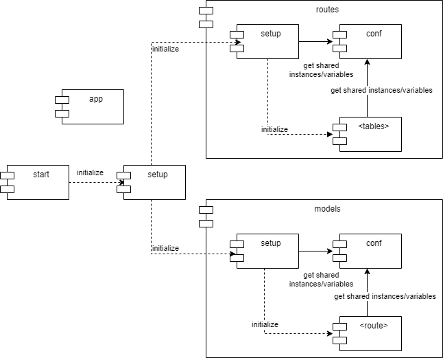

# Design
|Author|魏子軒|Date|2021-10-14|
|-|-|-|-|

## Database Design

- The DB is in-memory sqlite database.

### **Table: task**

|Column Name|Data Type|Primary Key|
|-|-|-|
|id|integer|O|
|name|string|X|
|status|boolean|X|

## Architecture



The architecture separates routes (for API) and models (for database) into modules.

Each module has *conf.py* which defines shared variables and *setup.py* which initializes routes/models by importing.
(*\<table\>/\<route\>* stands for implementation of tables/routes (e.g., *tasks.py* in models and routes))

Since *\<table\>/\<route\>* and *setup* require shared variables and *setup.py* import *\<table\>/\<route\>* for initialization, the separation of *conf.py* and *setup.py* avoids circular import.
Due to the same reason, flask app instance is created in *app.py* which are imported by almost all Flask codes.

The execution of the web server follows the similar pattern.

*start.py* initializes the whole server by importing *setup.py* which later imports *routes/setup.py* and *models/setup.py*. And then *start.py* start the server.

## Containerization

The server is containerized in docker image with following port configuration.
- Run server on 58080 port in container
- Expose 58080 port of the container
- Publish 58080 port of the container on 58080 port of host

Dockerfile defines 2 stages of image
- server: run the server
- unit-test: test the server code

## Web APIs

Since the specification of web APIs is not complete and RESTful, the API design is refined as below.
In addition, some error message are designed when the requests fail.
Request and response data are shown below the following table.

|url|method|request data|response code|response data|usage & meaning|
|-|-|-|-|-|-|
|/tasks|GET||200|Get_All_Response|Get all tasks|
|/tasks|POST|Post_Request|201|Post_Response|Create a task|
||||500|Error_Message|Failed in task creation|
|/tasks/\<id\>|GET||200|Get_Response|Get the task of the specific id|
||||404|Error_Message|No task of such id in task getting|
||||500|Error_Message|Failed in task getting|
|/tasks/\<id\>|PUT|Put_Request|200|Put_Response|Update the task of the specific id|
||||404|Error_Message|No task of such id in task update|
||||500|Error_Message|Failed in task update|
|/tasks/\<id\>|DELETE||200|Delete_Response|Delete the task of the specific id|
||||404|Error_Message|No task of such id in task deletion|
||||500|Error_Message|Failed in task deletion|

### Data Definition

- Get_All_Response
```json
{
    "result": [
        {"id": 1, "name": "name", "status": 0}
    ]
}
```
- Post_Request
```json
{
  "name": "買晚餐"
}
```
- Post_Response
```json
{
    "result": {"name": "買晚餐", "status": 0, "id": 1}
}
```
- Error_Message
```json
{
    "message": "description of error"}
}
```
- Get_Response
```json
{
    "result": {
        "id": 1, "name": "name", "status": 0
    }
}
```
- Put_Request
```json
{
    "name": "買早餐",
    "status": 1
}
```
- Put_Response

```json
{
  "name": "買早餐",
  "status": 1,
  "id": 1
}
```
- Delete_Response
```json
{
  "result": true
}
```

## Testing

- Use pytest to run unit tests defined in *tests*.
- Use GitHub CI to run test after every push to any branch.

## Environment and Dependencies

- python==3.9.1
- pipenv==2020.11.15
- packages for server running
    - flask-restx==0.5.1 (use flask==2.0.2)
        Since Flask no longer provides updates for 1.x.x, the server use Flask 2.x.x
    - flask-sqlalchemy==2.5.1
- packages for testing
    - pytest==6.2.5
- packages for development
    - autopep8==1.5.7
    - pylint==2.11.1
- docker==20.10.8
- docker-compose==2.0.0